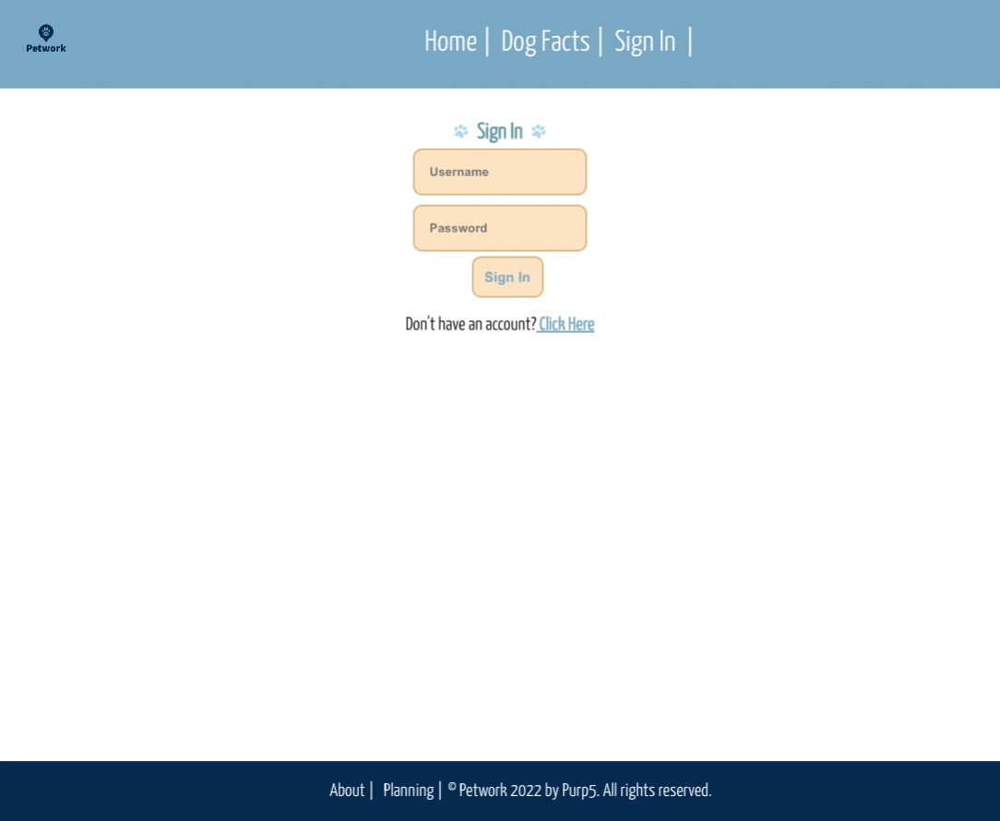

# Petwork-Backend
___________________

### Project Description
This is the backend of a pet (dog) parent networking app, where users can create profiles to share information about their dogs, look up basic information about different dog breeds, and "love" (like) their favorite breeds to save for later!

### Link to Deployed Application
Live version deployed to Netlify at: (*Coming Soon*)

### List of Technologies Used
React, JavaScript, HTML5, CSS3

### Application Functionality 
- From the home page, users are able to view dog facts list and go to the sign in page

- Users are able to search the dog facts page for a specific breed 

- If users don't have an account already, they can sign up and insert information about their dog

- After a successful log in, users are redirected to their profile and are now able to view "favorited" dogs 

- Users can view and edit information about their profile. Users can also log out from the profile page 

- Users are able to use the app across a variety of screen sizes and devices, including mobile and tablet

### Major Hurdles
- Getting the backend and frontend to deploy and connect correctly 
- Fetching the signed-in user's information from the backend to display on the profile
- Connecting favorites to be user-specific favorites and save after log out / reappear on next log in 
- Successfully allowing users to create accounts and log in
- Changing header options depending on whether a user is signed in or not 
- Displaying the correct individual dog clicked on from the dog facts page, instead of a different dog due to a discrepancy in the dog's API id vs. array index

### Link to Backend API

-Backend Live API: https://petwork-backend.herokuapp.com/
-Backend GitHub: https://github.com/senabon/petworkbackend/tree/main

### Authors / Contributors
Briana Casey, Sena Diaz, & Taylor Lee

### Source Citations
- https://www.youtube.com/watch?v=HANSMtDy508
- https://www.freecodecamp.org/news/how-to-use-localstorage-with-react-hooks-to-set-and-get-items/
- https://www.youtube.com/watch?v=iw5RSIflYGU